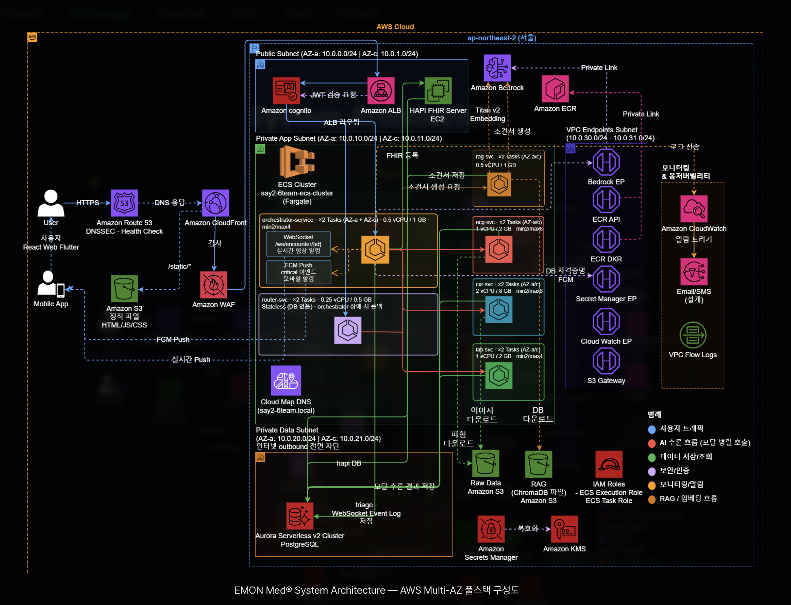

## Hi there 👋
<div align="center">


<a href="https://readme-typing-svg.demolab.com">
  
</a>

<br/>


<a href="https://app.notion.com/p/2606eb79fff2808a8f2df9e1af81aea4"></a>
<a href="mailto:wonjeonga88@gmail.com"></a>
<a href="https://github.com/jeongawon"></a>

<br/><br/>


</div>

## `$ cat about.md`

의료 AI 엔지니어를 목표로 성장해 온 **원정아**입니다. 딥러닝 모델 설계·학습부터 멀티모달 AI 통합, LLM/RAG 파이프라인 구축, AWS 클라우드 네이티브 배포까지 AI 서비스의 전 주기를 직접 수행해 왔습니다. 단일 모델을 넘어 **여러 AI 모듈을 실제 운영 가능한 하나의 시스템으로 통합**한 경험이 가장 큰 강점이며, 연구 단계의 모델을 신뢰성 있는 실제 서비스로 잇는 엔지니어를 지향합니다.

```bash
$ cat profile.yaml
name     : Wonjeong A (원정아)
role     : AI Engineer  ·  Medical AI / Multimodal / LLM·RAG
career   : SKKU AWS Bio-Healthcare Bootcamp (SAY 2nd)  ·  Team Lead
domain   : Medical imaging & signal analysis, clinical decision support
stack    : PyTorch · Mamba/S6 · LLM/RAG · AWS · FastAPI · React
seeking  : Medical AI Engineer / ML Engineer / AI Research Engineer
```

## `$ ls skills/`

<div align="center">

**AI / Machine Learning**


**Cloud / MLOps / Serving**


**Backend / Web**


**Data / Tools**


<br/>


</div>

## `$ cat expertise.md`

| 분야 | 숙련도 | 세부 |
|------|--------|------|
| Deep Learning | `●●●●○` | PyTorch · TensorFlow, Mamba/S6(시계열), DenseNet/UNet(영상), 멀티모달 통합 |
| LLM / RAG | `●●●●○` | Amazon Bedrock(Claude), ChromaDB RAG, 프롬프트 엔지니어링, Guardrails |
| AWS / MLOps | `●●●○○` | ECS Fargate, Aurora, EC2, Bedrock, CloudFormation, CloudWatch |
| Data / Preprocessing | `●●●●○` | Pandas, NumPy, scikit-learn, SQL, 신호·텍스트 전처리 파이프라인 |
| Backend / Serving | `●●●○○` | FastAPI, Docker, ONNX Runtime, Java/Spring Boot, React 연동 |
| Leadership | `●●●●●` | 다수 프로젝트 팀장 — 기획·아키텍처·일정 조율·산출물 총괄 |

## `$ git log --projects`

<details open>
<summary><b>🏥 EMON Med — AI 기반 응급실 멀티모달 의사결정 지원 시스템</b></summary>

<br/>

ECG · 흉부 X-ray · 혈액검사 · 임상기록을 각각 독립 AI 서비스로 분석하고, 중앙 오케스트레이터가 환자 단위로 취합한 뒤 **RAG + Bedrock(LLM)** 으로 최종 임상 소견서를 생성하는 **AWS 클라우드 네이티브 멀티모달 AI 시스템**.

**나의 역할 — AI 모델 개발 + 시스템 통합 리딩 (팀장, 4인)**
- 🧠 **ECG 모달** : S6/Mamba 기반 12-lead ECG → 24개 질환 멀티라벨 예측 (**Macro AUROC 0.814**), 인구통계 결합·긴급도 가중 Loss
- 🧪 **Lab Rule Engine** : 임상 cut-off 기반 Critical Flag 8종 + 주호소별 해석 Profile 7종 (추론 `<10ms`)
- 🔗 **FE + BE 연동** : React 대시보드, 오케스트레이터–모달 연동, 운영 DB 저장까지 end-to-end
- 👥 **팀장(총괄)** : 인프라 아키텍처 5개 영역 분담, 일정·멘토링 운영, YAML 핸즈온 수정·핸드오프 문서화

| 항목 | 내용 |
|------|------|
| Stack | `S6/Mamba` `PyTorch` `ONNX Runtime` `Bedrock` `RAG/ChromaDB` `ECS Fargate` `Aurora` `FastAPI` `React` |
| Scale | 4개 모달 독립 서비스 + 중앙 오케스트레이터 (마이크로서비스) |
| Impact | ECG Macro AUROC 0.814 · Rule Engine 추론 <10ms · 멀티모달 임상 소견서 자동 생성 |

</details>

<details>
<summary><b>🗺️ SORIMAP — AI 기반 우리동네 채팅지도 (해커톤, 팀장/백엔드 총괄)</b></summary>

<br/>

[](https://github.com/jeongawon/gangnangkong-backend)

주민이 SNS·커뮤니티에 올린 민원·문화 글을 **NLP로 감정 분석·분류**하고, **위치 + 감정 강도** 기반으로 지도에 시각화하는 지역 소통 플랫폼. 민원을 행정기관과 연결해 처리 과정을 투명화.

**나의 역할 — 팀장 · 백엔드 총괄 · 서비스 기획**
- 데이터 수집·분석 API, 감정 분석·분류 로직 연동, DB 설계
- Kakao Map 지도 시각화·공감 기능 프론트 연동, 서버 배포·시연 안정화
- 문제 정의 → 핵심 기능(민원 감정 시각화·공감 기반 지도화) 기획, 팀 리딩·발표 주도

| 항목 | 내용 |
|------|------|
| Stack | `NLP 감정분석` `텍스트 분류` `Kakao Map API` `REST API` `MySQL` `크롤링` |
| Impact | SNS 민심 → 지도 시각화 → 행정 연계로 민원 해결 투명화 |

</details>

<details>
<summary><b>📅 캠퍼스 캘린더 (Campus Calendar · Unidays) — 팀장/백엔드 총괄</b></summary>

<br/>

[](https://github.com/jeongawon/backend-unidays)

과제·시험·팀플·교내외 행사·공모전까지 대학생활 전체 일정을 하나의 캘린더로 통합하는 대학생 맞춤형 서비스. 팀 일정 공유와 D-day 알림 지원.

**나의 역할 — 팀장 · 백엔드 총괄 · 서비스 기획**
- 회원 관리·일정 CRUD REST API 및 MySQL 설계·연동 직접 구현
- 개인/팀 일정 공유, 행사 큐레이션, 마감일 D-day 알림 로직 개발
- 프론트 연동·테스트, 배포/운영 지원, 최종 발표 주도

| 항목 | 내용 |
|------|------|
| Stack | `REST API` `MySQL` `일정 CRUD` `D-day 알림` `팀 일정 공유` |
| Impact | 흩어진 대학 일정 통합 → 일정 누락 감소·팀 협업 효율 향상 |

</details>

<details>
<summary><b>📖 별책부록 (Antipamine) — AI 기반 문학 추천 플랫폼 (백엔드/브랜드 기획)</b></summary>

<br/>

숏폼·도파민 과소비 시대의 '정서적 해독제'. 사용자의 감정·상황에 맞는 문학 작품을 **생성형 AI(LLM)** 로 추천하는 정서 기반 큐레이션 플랫폼.

**나의 역할 — 백엔드 개발 · 브랜드 기획/발표**
- 사용자·추천 API 설계, 생성형 AI 개인화 추천 로직 연동, MySQL 설계
- AWS 기반 API 서버 배포·운영
- 서비스 콘셉트·브랜드 아이덴티티 기획, 최종 발표 자료 제작

| 항목 | 내용 |
|------|------|
| Stack | `생성형 AI(LLM)` `개인화 추천` `REST API` `MySQL` `AWS` |
| Impact | 장르가 아닌 '정서적 니즈' 기반 추천 + 독서 루틴 설계 |

</details>

<details>
<summary><b>🎙️ EDU-LOG (멀티모달) — 상담 음성 기반 학습 인사이트 자동화</b></summary>

<br/>

교육 현장의 상담 음성을 **STT → LLM → 대시보드**로 잇는 멀티모달 인사이트 파이프라인. 비정형 음성·텍스트를 정량 학습 지표로 전환하는 MVP. 청년창업 아이디에이션 1·2차 심사 통과(실리콘밸리 연수 연계).

**나의 역할 — 기획 · 구현**
- S3 + AWS Transcribe(STT)로 상담 녹음 → 텍스트 변환
- Amazon Bedrock/GPT로 취약과목·집중도·감정 태깅
- RDS 적재 후 pandas·QuickSight로 주차별 대시보드 자동 갱신

| 항목 | 내용 |
|------|------|
| Stack | `AWS S3` `AWS Transcribe` `Amazon Bedrock/GPT` `AWS RDS` `pandas` `QuickSight` |
| Impact | 상담 태깅 LLM + 자동 리포트로 학습 위험군 조기 식별 기반 마련 |

</details>

<details>
<summary><b>📝 Research — 의료 데이터 프라이버시 & 접근성 AI</b></summary>

<br/>

| 논문 | 내용 |
|------|------|
| JKAIA (2024) | 「연합학습의 개인정보보호 한계와 차등 개인정보보호 결합을 통한 의료데이터 분석 보안 향상」 · [DOI](https://doi.org/10.24225/jkaia.2024.2.2.15) |
| ipact (2025.06) | 「시각 장애인을 위한 위험 감지 및 사물 인식 시스템 연구」 — 우수논문상 |

</details>

## `$ cat aws-architecture.md`

**EMON Med의 AWS Multi-AZ 클라우드 네이티브 풀스택 아키텍처를 직접 설계·구축**했습니다 — `ap-northeast-2`(서울), 2개 AZ, Public/Private App/Private Data 3-tier 서브넷, VPC Endpoints(PrivateLink) 기반 프라이빗 통신. 아래 서비스 전부를 실제 프로젝트에서 구성·운영했습니다.

<div align="center">



</div>

**Edge / CDN / DNS**


**Compute / Containers**


**AI / ML**

-2DD4BF?style=flat-square&labelColor=161B22)


**Networking / Service Discovery**


**Data / Storage**

-2DD4BF?style=flat-square&labelColor=161B22)

-2DD4BF?style=flat-square&labelColor=161B22)

**Security / Identity**


**Observability / IaC**


-2DD4BF?style=flat-square&labelColor=161B22)

## `$ cat experience.log`

**🎓 성균관대 AWS 바이오헬스케어 부트캠프 (SAY 2기)** · `2025.12 – 2026.05` · 수료
- 응급실 멀티모달 의사결정 지원 AI **EMON Med** 기획·총괄 (팀장)
- ECG 시계열 모델(S6/Mamba) 학습, 임상 Rule Engine 설계
- 중앙 오케스트레이터–모달 오케스트레이션 연동 구현
- AWS 클라우드 네이티브 인프라 구성·배포 (CloudFormation)

`Medical AI` `Multimodal` `LLM/RAG` `AWS` `Team Lead`

---

**🦁 멋쟁이사자처럼 13기 운영진** · `2025`
- 세션 운영 및 프로젝트 기획·조율, 백엔드 운영
- 2025 해커톤 프로젝트 **Sorimap** 팀장/운영진

`Backend` `Project Planning` `Leadership`

---

**🦁 멋쟁이사자처럼 12기** · `2024`
- 연합 해커톤 참가 — **간지톤 대상 수상**

`Hackathon` `Team`

---

**📚 을지대 교내 학술대회 / 학술제** · `2024`
- 논문 발표 (구두) — 우수상·문화상 수상, JKAIA 논문 투고

`Research` `Federated Learning` `Differential Privacy`

## `$ cat achievements.md`

<div align="center">

| 시기 | 성과 | 상세 |
|:----:|:-----|:-----|
| `2024.11` | 🏆 간지톤 해커톤 **대상** | 멋쟁이사자처럼 연합 해커톤 |
| `2025.06` | 🥇 ipact 학술대회 **우수논문상** | 국제문화기술진흥원 — 시각장애인 위험감지·사물인식 |
| `2024` | 🎖️ 교내 학술대회 **우수상 (구두발표)** | JKAIA 논문 투고 (연합학습 + 차등 프라이버시) |
| `2023.09` | 📗 TOEIC **810** | |
| `2025` | 🌉 실리콘밸리 창업 아이디에이션 연수 | 글로벌 프로그램 참가 |

</div>

## `$ ls education/ certifications/`

<div align="center">

-2DD4BF?style=flat-square&labelColor=161B22&logo=googlescholar&logoColor=E6EDF3)


</div>

## `$ github --stats`

<div align="center">


<br/>


</div>

## `$ ./activity-graph`

<div align="center">


</div>

## `$ ./summary-cards`

<div align="center">


</div>

## `$ ./snake`

<div align="center">


</div>

## `$ cat current_focus.yaml`

```yaml
current_focus:
  learning:
    - High-precision medical image & signal analysis
    - Diagnostic-support AI reliability & evaluation
  building:
    - EMON Med — multimodal ER decision-support (post-bootcamp iteration)
    - RAG pipelines on Amazon Bedrock (Claude)
  exploring:
    - MLOps on AWS (ECS Fargate, CloudFormation)
    - Model serving with ONNX Runtime & FastAPI
  open_to:
    - Medical AI Engineer
    - ML / AI Research Engineer
```

## `$ ./connect`

<div align="center">

<a href="mailto:wonjeonga88@gmail.com"></a>
<a href="https://app.notion.com/p/2606eb79fff2808a8f2df9e1af81aea4"></a>
<a href="https://github.com/jeongawon"></a>

<br/><br/>

<i>"연구 단계의 모델을 신뢰성 있는 실제 서비스로 잇는다."</i>


</div>
